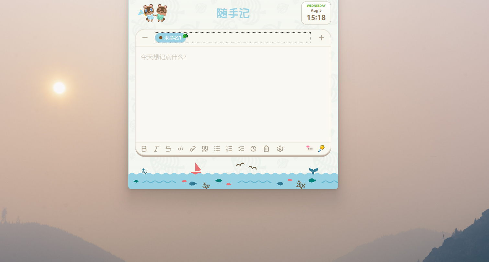
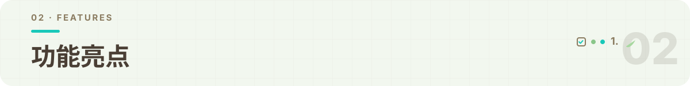
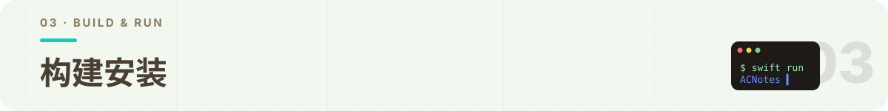
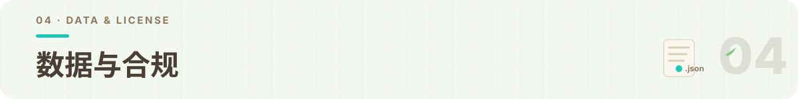

<p align="center">
  
</p>

# 动森版随手记 (ACNotes) for Windows

> 🍃 住在 Windows 屏幕顶部的动物之森风随手记

**鼠标移到屏幕顶部中央**，奶油色的笔记面板便随之展开；记完移开鼠标，自动收起 —— 全程不打断你正在用的应用。macOS 版 [ac-notes](https://github.com/wswuyuwen/ac-notes) 的 Windows 移植（基于 NotchNotes for Windows 底座换肤）。

灵感来源于开源项目 [NotchNotes](https://github.com/oil-oil/NotchNotes)，感谢开源社区的强大：

- ✅ Windows 10 / 11（x64），免装版双击即用 / 轻量版仅 2.5MB
- ✅ 动物之森主题：岛景背景 + 奶油/木色/薄荷绿配色 + 快乐体
- ✅ 编辑器依赖全量本地化，完全离线可用，启动秒开（~1.5s）
- ✅ 全中文界面

---

<p align="center">
  
</p>

一个"住在屏幕顶部的随手记"：不占任务栏、不占桌面空间，笔记就藏在屏幕顶部中央。需要时鼠标移上去，面板展开即写；写完了移开，面板收起，回到原来的工作。

- **Hover 模式**：鼠标移入顶部中央展开，移出自动收起
- **双击托盘**：系统托盘常驻，双击图标展开面板
- **快速收起**：点击面板外 / 按 `Esc`（全局键盘钩子，焦点在编辑器内也生效）

---

<p align="center">
  
</p>

- **WYSIWYG 富文本编辑**：粗体 / 斜体 / 删除线 / 行内代码 / 链接 / 引用 / 列表 / 待办清单（真实勾选框）/ 时间戳
- **多标签笔记**：胶囊标签 + 叶子徽标、右键删除、托盘一键新建；标签条超宽时触控板 / 滚轮 / 鼠标拖拽横滑
- **双主题**：sea 海之主题 / tree 树之主题，工具栏一键切换
- **自动保存**：双通道持久化（`notes.json` + 注册表副本，按保存时间取新）
- **启动秒开**：Tiptap 依赖 147 个模块本地打包，初始化约 1.5 秒，断网可用
- **细节打磨**：自定义手型光标、删除确认弹窗打字机动画、防误触状态机

<p align="center">
  
</p>

---

<p align="center">
  
</p>

### 安装

双包发布（脚本 `scripts/publish.sh`）：

| 包                                        | 体积              | 适用             | 说明                                                                                      |
| ----------------------------------------- | ----------------- | ---------------- | ----------------------------------------------------------------------------------------- |
| `ac-notes-framework-dependent-<日期>.zip` | **2.5MB**（主力） | 已装 .NET 的机器 | 需 .NET 8 Desktop Runtime (x64)：[下载](https://dotnet.microsoft.com/download/dotnet/8.0) |
| `ac-notes-for-windows-win-x64.zip`        | 70MB（免装版）    | 普通用户         | 自包含，双击即用，无需装 .NET                                                             |

> 首次运行若弹 SmartScreen「未知发布者」→ 更多信息 → 仍要运行

### 开发构建

环境要求：**Windows 10/11** + [.NET 8 SDK](https://dotnet.microsoft.com/download/dotnet/8.0)（含 Desktop 工作负载，安装器默认勾选）。

```bash
# 构建
dotnet build src/AcNotes.Windows -c Release

# 本地运行
dotnet run --project src/AcNotes.Windows

# 发布：框架依赖小包（需目标机装 .NET 8 Runtime）
dotnet publish src/AcNotes.Windows -c Release -r win-x64 --self-contained false -o publish/framework-dependent

# 发布：自包含免装包（目标机无需 .NET）
dotnet publish src/AcNotes.Windows -c Release -r win-x64 --self-contained true -o publish/win-x64
```

> 项目自带 `scripts/publish.sh`（双包发布脚本）与 `scripts/run-local.sh`（本地部署），均可直接使用。

首次启动后：双击托盘图标，或把鼠标移到屏幕顶部正中央，面板展开即开始记录。

---

<p align="center">
  
</p>

## 项目结构

- `src/AcNotes.Windows/` —— 主程序（MainWindow.cs 为 UI + 状态机，双窗口架构）
- `src/AcNotes.Windows/vendor/` —— Tiptap 本地化依赖（147 模块，离线可用）
- `src/AcNotes.Windows/Assets/` —— 动森主题素材（面板背景、sea/tree 页脚、图标与字体）
- `scripts/` —— 部署（run-local.sh）、发布（publish.sh）脚本

## 数据位置

- 笔记：`%APPDATA%\AcNotes\notes.json` + 注册表 `Software\AcNotes`（双通道副本）
- 日志：`%APPDATA%\AcNotes\poc.log` / `console.log`

## 致谢

- 界面引擎与架构：[NotchNotes](https://github.com/oil-oil/NotchNotes) (oil-oil)
- Windows 底座：[NotchNotes for Windows](https://github.com/wswuyuwen) 技术验证（双窗口 / WebView2+Tiptap / 全局钩子）
- 动森视觉体系：[animal-island-ui](https://github.com/guokaigdg/animal-island-ui) (guokaigdg, CC BY-NC 4.0) —— 色值、组件样式、背景素材与图标设计均参考自此库
- macOS 原版：[ac-notes](https://github.com/wswuyuwen/ac-notes)（SwiftUI 动森随手记，视觉蓝本）
- 编辑器内核：[Tiptap](https://tiptap.dev) / [ProseMirror](https://prosemirror.net)（MIT）

## 注意事项

- 本项目仅用于个人学习、研究与非商业展示，禁止任何形式的商业使用、二次售卖或盈利行为。
- 不用于任何商业产品、企业项目、对外服务或付费模板。
- 使用本项目产生的任何风险由使用者自行承担。

## 版权与免责声明

- 本项目并非任天堂官方产品，与任天堂株式会社无任何关联、授权或合作关系。
- 项目名称及文案中的游戏相关表述仅为风格描述性引用，不构成商标使用或品牌关联。
- 界面风格与视觉元素仅作设计灵感参考，不构成对原作品的复制或侵权。
- 本项目基于开源项目 NotchNotes 改造，并参考 animal-island-ui（CC BY-NC 4.0）的视觉体系；使用时请遵守相应开源协议（保留署名、非商业使用）。
- 若版权方认为相关内容存在侵权嫌疑，可通过 GitHub Issue 联系，本人将在第一时间进行整改或删除处理。
